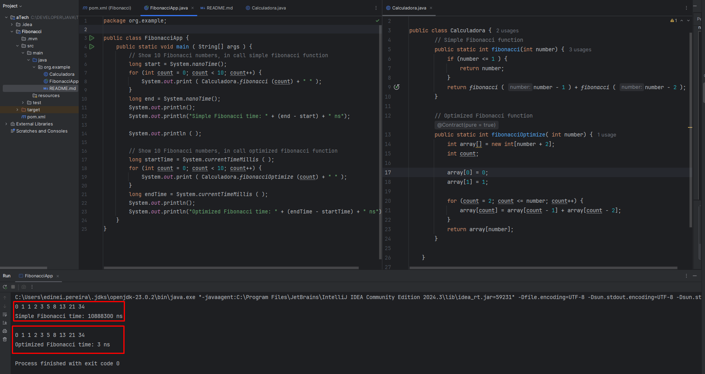
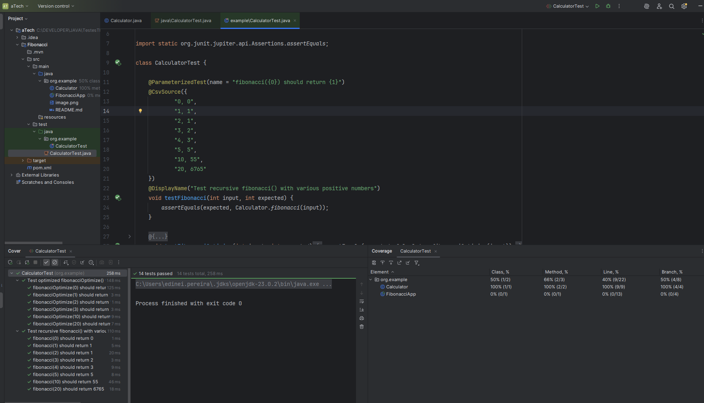

## Ambas as implementações calculam o valor de Fibonacci para um dado n, mas usam abordagens totalmente diferentes. A principal diferença entre elas está na eficiência e na forma como resolvem o problema.

### Implementação Simples: Recursiva
Como funciona: A função chama a si mesma recursivamente. Para calcular fibonacci(number), ela chama fibonacci(number-1) e fibonacci(number-2) até atingir a condição de parada (number <= 1).

Vantagens: O código é elegante e conciso. Reflete diretamente a definição matemática da sequência de Fibonacci.

Desvantagens: É extremamente ineficiente para valores de number maiores. A complexidade de tempo é exponencial.
 Isso acontece porque a função recalcula os mesmos valores várias e várias vezes, resultando em um crescimento absurdo do número de chamadas. Por exemplo, para calcular fibonacci(5), fibonacci(3) é calculado duas vezes. fibonacci(2) é calculado três vezes.

## Conclusão
Em um ambiente de produção, a Implementação 2 otimizada é a escolha correta. A performance é infinitamente superior, especialmente para valores de numeros maiores. Embora a recursão da Implementação simples seja um bom exercício para entender o conceito, ela não é viável para uso prático devido ao seu alto custo computacional.

### Exemplo de execução; 

### Unit Tests;
