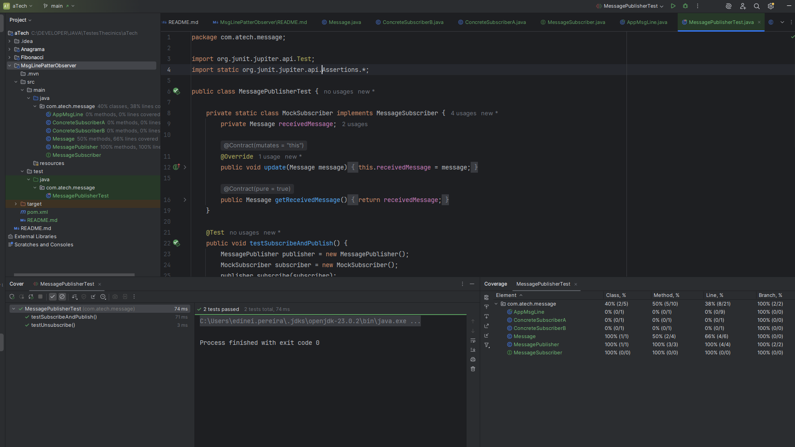

## Fila de Mensagens com o Padrão Observer

Em resumo, a maior dificuldade é transformar um padrão de design de software em um único processo (o Observer) em um sistema robusto de mensagens distribuídas, que requer soluções complexas para falhas de rede, consistência de dados e escalabilidade. É por isso que sistemas dedicados de mensageria como o Kafka são tão populares e poderosos.

### Problemas:

* Garantir que todos os subscribers recebam a mensagem (falha de rede).
* Evitar duplicidade (subscriber recebendo a mesma mensagem várias vezes).
* Persistência (se o sistema cair, as mensagens não devem ser perdidas).
* Solução comum: usar Message Brokers (Kafka, RabbitMQ, AWS SNS/SQS) para lidar com escalabilidade e confiabilidade.

Em uma arquitetura de mensagens com o padrão de design Observer, podemos simular uma fila de mensagens onde um "**Publisher**" (também chamado de "*Subject*" ou "*Observable*") notifica múltiplos "*Subscribers*" (ou "*Observers*") sobre novas mensagens.

Estrutura de Classes e Métodos
A implementação segue o padrão clássico do Observer, com três componentes principais: o "**Subject**" (o que está sendo observado), o "**Observer**" (quem está observando) e uma classe de "Mensagem".

"**Message**": Uma classe simples para encapsular o conteúdo da mensagem. Pode ter atributos como origin e content.

"**MessagePublisher**": A classe Publisher. Ela atua como o Subject.

"**Atributos**":

* private Listmessagesubscriber subscribers : Uma lista para manter o registro de todos os subscribers interessados.

"**Métodos**":

public void subscribe(MessageSubscriber subscriber);: Permite que um novo subscriber se registre para receber notificações.

public void unsubscribe(MessageSubscriber subscriber);: Permite que um subscriber cancele seu registro.

public void publishMessage(Message message);: Este é o método principal. Ele percorre a lista de subscribers e chama o método update de cada um, passando a nova mensagem.

"**MessageSubscriber**": A interface que define o contrato para os Observers.

"**Métodos**":

public void update(Message message);: Este método é chamado pelo Publisher para notificar o Subscriber sobre uma nova mensagem. Cada Subscriber implementará sua própria lógica para lidar com a mensagem recebida.

"**ConcreteSubscriberA**" e "**ConcreteSubscriberB**": Classes concretas que implementam a interface "**MessageSubscriber**". Cada uma delas pode ter um comportamento diferente ao receber uma mensagem. Por exemplo, uma pode imprimir a mensagem no console, enquanto outra pode armazená-la em um banco de dados.

### Cenário de Máquinas Distribuídas

Em um cenário de várias máquinas distribuídas rodando instâncias do seu software, o problema mais difícil de resolver do ponto de vista de comunicação seria a garantia de consistência e entrega de mensagens em um ambiente assíncrono e com falhas.

O padrão Observer é um modelo de comunicação síncrona em um único processo. Quando você o estende para um ambiente distribuído, os desafios se multiplicam:

"**Confiabilidade (Entrega de Mensagens)**": Como garantir que cada mensagem publicada seja entregue a todos os subscribers, mesmo se houver falha de rede ou se uma máquina de subscriber estiver offline temporariamente? A implementação simples do Observer falharia aqui. Seria necessário usar um protocolo de mensagens confiável, com confirmações (ACKs), re-envios e persistência de mensagens (fila persistente).

"**Consistência e Ordenação**": Como garantir que as mensagens sejam processadas na ordem em que foram publicadas? Se um publisher envia as mensagens M1 e M2 e um subscriber as recebe como M2 e M1, isso pode levar a estados inconsistentes. Em um ambiente distribuído, não há uma ordem global de tempo fácil de definir. Isso exigiria a implementação de um mecanismo de ordenação, como carimbos de data/hora (timestamps) ou sequências de eventos (event sourcing).

"**Descoberta de Serviços**": Como os subscribers em diferentes máquinas descobrem a localização do publisher e vice-versa? Em um único processo, é apenas uma referência de objeto. Em um sistema distribuído, isso exigiria um mecanismo de descoberta de serviços (como ZooKeeper, Consul ou etcd) ou o uso de um broker de mensagens centralizado (como Kafka, RabbitMQ ou ActiveMQ).

### Execução do Modulo;

